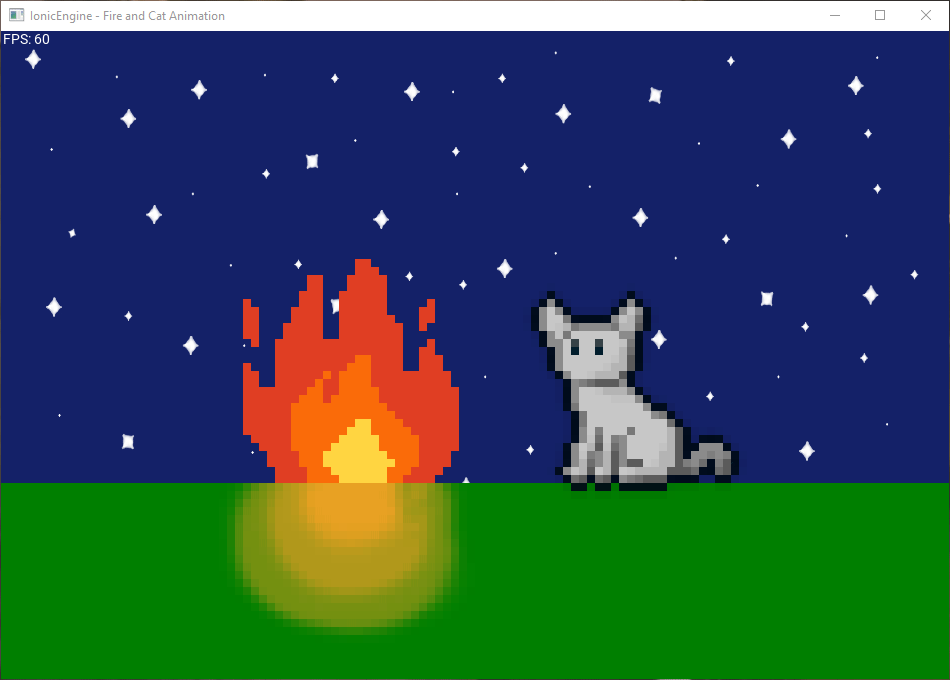
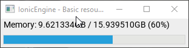
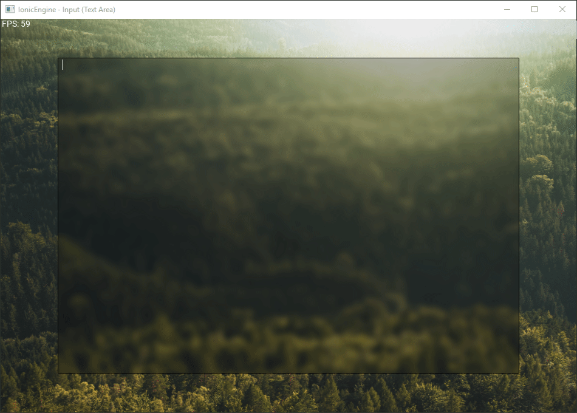

# IonicEngine

A multimedia graphics library written in C++, mainly 2D oriented.

## Installation

### Windows

Please install from source.

### Linux

Please install from source. (Will be on AUR)

### From source

Build the sources with CMake and make and install with `make install`, and keep the install manifest to allow the uninstallation with `make uninstall`.

## Showcase

### Graphics

Fire and cat animation:

[Fire and Cat animation (with Sound)](https://www.youtube.com/watch?v=_-C3E4uoOtY)

Resources monitor (simple desktop application example):

### Input

Text area example:
